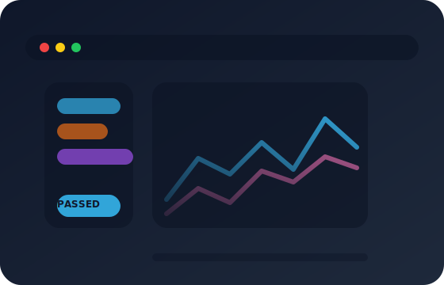

# Infosys Springboard Internship (Batch 1) – Automated Testing Framework

> A flagship Infosys Springboard internship project delivering end-to-end quality intelligence for modern software teams.

<p align="center">
  
</p>



AutomateUI and API suites, orchestrate schedules, and surface actionable analytics from a single Spring Boot portal. Designed and implemented by Batch 1 interns as a production-ready reference implementation that blends engineering rigor with polished product experience.

## At a glance

- **Primary use case:** Accelerate enterprise regression cycles by centralising test authoring, scheduling, execution, and reporting.
- **Target users:** QA engineers, SDETs, release managers, and delivery leads who need real-time insight into test health.
- **Live experience:**
  - 🌐 Deployed instance: [`https://test-automation-framework-latest.onrender.com`](https://test-automation-framework-latest.onrender.com)
  - 🎥 Interactive demo: [`https://test-automation-framework-latest.onrender.com/demo/login`](https://test-automation-framework-latest.onrender.com/demo/login)
- **Tech stack:** Java 25, Spring Boot 3.4, Thymeleaf, Selenium WebDriver, MySQL 8.x, Quartz, Spring Async, Docker.

---

## Table of contents

1. [Project narrative](#project-narrative)
2. [Product capabilities](#product-capabilities)
3. [Architecture overview](#architecture-overview)
4. [Experience the platform](#experience-the-platform)
5. [Getting started for developers](#getting-started-for-developers)
6. [Test authoring handbook](#test-authoring-handbook)
7. [Continuous delivery automation](#continuous-delivery-automation)
8. [Operations & deployment](#operations--deployment)
9. [Roadmap & internship reflections](#roadmap--internship-reflections)
10. [Contributors](#contributors)

---

## Project narrative

Infosys Springboard's inaugural internship batch was challenged to create a platform that could:

- **Unify fragmented automation efforts** across API and UI suites.
- **Offer management-level visibility** with dashboards that highlight reliability, trendline regressions, and execution SLAs.
- **Scale with enterprise constraints**, including nightly schedules, multi-project ownership, and rigorous access control.

The result is a modular framework that turns JSON definitions into executable suites, streams results to analytics, and closes the loop with notifications and exports.

## Product capabilities

| Module | Highlights | Value delivered |
| --- | --- | --- |
| Test Authoring | JSON-based DSL, bulk import, version snapshots | Rapid test onboarding without IDE dependency |
| Execution Engine | Parallel runners, Selenium WebDriver integration, API clients | Reduced runtime and consistent environment setup |
| Scheduler | Cron-like planner, manual triggers, run history | Predictable daily/weekly/monthly cadences |
| Reporting & Analytics | Trend charts, failure clustering, export to CSV/PDF | Insightful retrospectives for QA and leadership |
| Notifications | Brevo email integration, custom webhooks | Immediate stakeholder updates on regressions |
| Asset Management | ImageKit-backed screenshot storage, local fallback | Rich evidence for debugging UI failures |

### Signature functional flows

1. **Regression planning:** Upload suites → configure cadence → receive deep-dive analytics each morning.
2. **Release readiness:** Execute gating suite on demand → instantly export annotated report for sign-off.
3. **Incident triage:** Use dashboard filters → inspect failure artifacts → re-run impacted suites directly from UI.

## Architecture overview

```text
┌──────────────────────┐        ┌──────────────────────┐
│  Web UI (Thymeleaf)  │◀──────▶│  REST Controllers    │
└─────────▲────────────┘        └─────────▲────────────┘
          │                              │
          │                      ┌───────┴─────────┐
          │                      │  Service Layer  │
          │                      │  (Spring Boot)  │
          │                      └───────▲─────────┘
          │                              │
          │                      ┌───────┴─────────┐
          │                      │  Scheduler &    │
          │                      │  Async Workers  │
          │                      └───────▲─────────┘
          │                              │
          ▼                      ┌───────┴─────────┐
┌──────────────────────┐         │ Selenium Runner │
│  MySQL 8 Persistence │         │ + API Client    │
└──────────────────────┘         └───────▲─────────┘
                                          │
                                  ┌───────┴─────────┐
                                  │  Reporting &    │
                                  │  Export Engine  │
                                  └─────────────────┘
```

- **Security:** Spring Security-driven authentication, encrypted secrets for third-party APIs.
- **Scalability:** Quartz job store, asynchronous execution pools, Docker packaging for containerised deployments.
- **Extensibility:** Modular service abstractions allow plugging in new notification channels or storage providers.

## Experience the platform

- **Public demo:** [`https://test-automation-framework-latest.onrender.com`](https://test-automation-framework-latest.onrender.com)
- **Credentials for sandbox** *(read-only analytics)*: `demo@springboard.io / Demo@123`
- **Local walkthrough:** Visit [`http://localhost:8080/demo/login`](http://localhost:8080/demo/login) after starting the application to explore the reference UI.

> 📌 **UI design cues:** Inspired by enterprise observability dashboards—high-contrast dark mode, strong typographic hierarchy, and call-to-action emphasis for quick navigation between operations, analytics, and scheduling.

## Getting started for developers

### Prerequisites

- JDK 25+
- Maven 3.9+
- MySQL 8.x or compatible service
- Optional: Docker (for container build)

### Quick start

```bash
cp src/main/resources/application.properties.example src/main/resources/application.properties
# Populate database credentials, Brevo keys, and ImageKit configuration
mvn spring-boot:run
```

Visit `http://localhost:8080` and bootstrap your account. A starter project with sample suites is provisioned automatically.

#### Chromium compatibility tip

If Chrome/Chromium introduces a DevTools mismatch, align Selenium’s DevTools artifact:

```bash
mvn -Dselenium.devtools.artifact=selenium-devtools-v140 spring-boot:run
```

Replace `selenium-devtools-v140` with the artifact that matches your browser build.

## Test authoring handbook

### API example

```json
{
  "requests": [
    {
      "name": "Health check",
      "method": "GET",
      "url": "https://api.example.com/health",
      "expectedStatus": 200,
      "expectContains": ["ok"]
    }
  ]
}
```

### UI example

```json
{
  "steps": [
    {"action": "navigate", "url": "http://localhost:8080/demo/login"},
    {"action": "type", "by": "css", "selector": "#email", "text": "user@example.com"},
    {"action": "type", "by": "css", "selector": "#password", "text": "SuperSecret123"},
    {"action": "click", "by": "css", "selector": "button[type=submit]"},
    {"action": "assertTitle", "value": "Automation Demo Login"}
  ]
}
```

### Bulk import format

```json
{
  "tests": [
    {
      "name": "Smoke API",
      "type": "API",
      "definition": {
        "requests": [ { "name": "Ping", "method": "GET", "url": "https://httpbin.org/get" } ]
      }
    },
    {
      "name": "Smoke UI",
      "type": "UI",
      "definition": {
        "steps": [
          { "action": "navigate", "url": "http://localhost:8080/demo/login" },
          { "action": "assertTitle", "value": "Automation Demo Login" }
        ]
      }
    }
  ]
}
```

### Download ready-made import bundles

<table>
  <thead>
    <tr>
      <th>Suite</th>
      <th>Description</th>
      <th>Download</th>
    </tr>
  </thead>
  <tbody>
    <tr>
      <td>UI Sample Pack</td>
      <td>Complete end-to-end BlazeDemo booking scenarios showcasing waits, assertions, and form fills.</td>
      <td><a href="https://raw.githubusercontent.com/cbeAbishek/Springboard/Abi/UI_test_case.json" download>⬇️ Download UI JSON</a></td>
    </tr>
    <tr>
      <td>API Sample Pack</td>
      <td>HTTPBin-powered CRUD collection covering auth headers, redirects, and status assertions.</td>
      <td><a href="https://raw.githubusercontent.com/cbeAbishek/Springboard/Abi/API_test_case.json" download>⬇️ Download API JSON</a></td>
    </tr>
  </tbody>
</table>

## Continuous delivery automation

`.github/workflows/ci-tests.yml` keeps the project healthy by running on every push, daily at 06:00 UTC, and on manual dispatch:

```yaml
name: Java Test Suite

on:
  push:
    branches:
      - '**'
  schedule:
    - cron: '0 6 * * *'
  workflow_dispatch:

jobs:
  test:
    runs-on: ubuntu-latest
    steps:
      - uses: actions/checkout@v4
      - uses: actions/setup-java@v4
        with:
          distribution: temurin
          java-version: '23'
          cache: maven
      - run: mvn -B test
      - name: Publish README summary
        run: |
          {
            echo "## Project README"
            echo ""
            cat README.md
          } >> "$GITHUB_STEP_SUMMARY"
```

Every run publishes the README into the workflow summary, giving stakeholders instant access to the latest documentation alongside build results.

## Public endpoints & navigation map

| Route | Method(s) | Description |
| --- | --- | --- |
| `/` | GET | Landing page with single-click access to sign in or explore the product narrative. |
| `/demo/login` | GET | Lightweight sandbox UI demonstrating the built-in test selectors. |
| `/dashboard` | GET | Authenticated workspace summarising active projects and quality trends. |
| `/test-management` | GET/POST | Manage, import, and execute JSON-defined suites. |
| `/scheduler` | GET/POST | Configure cron-like jobs and trigger runs on demand. |
| `/reports` | GET/POST | Analyse regression history, export filtered datasets. |
| `/api/run/project/{projectId}` | POST | Fire-and-forget endpoint for CI/CD tools to trigger full project executions (expects optional `X-AUTOMATION-TOKEN` header). |

## Operations & deployment

### Docker workflow

```bash
docker build -t automation-platform .
docker run -p 8080:8080 automation-platform
```

### Testing locally

```bash
mvn -B test
```

Unit tests currently cover the reporting and export services. Expanding coverage to the scheduling engine and notification adapters is planned.

## Roadmap & internship reflections

- **Near-term enhancements:**
  - OAuth2 SSO for enterprise rollout.
  - Advanced analytics (flaky test detection, failure clustering).
  - Jira/ServiceNow connectors for automated defect logging.
- **Lessons from Batch 1:**
  - Early alignment on data contracts simplified UI/Backend collaboration.
  - Scheduled load tests were key to sizing thread pools and database connections.
  - Automating documentation (README summaries in CI) keeps stakeholders informed without manual effort.

## Contributors

| Role | Name |
| --- | --- |
| Product Mentor | Infosys Springboard Faculty Lead |
| Tech Lead | Abishek (Batch 1) |
| Engineering | Springboard Internship Cohort |

> 💡 Interested in extending the framework? Submit a pull request or open a discussion—Batch 1 will happily guide the next wave of interns!
