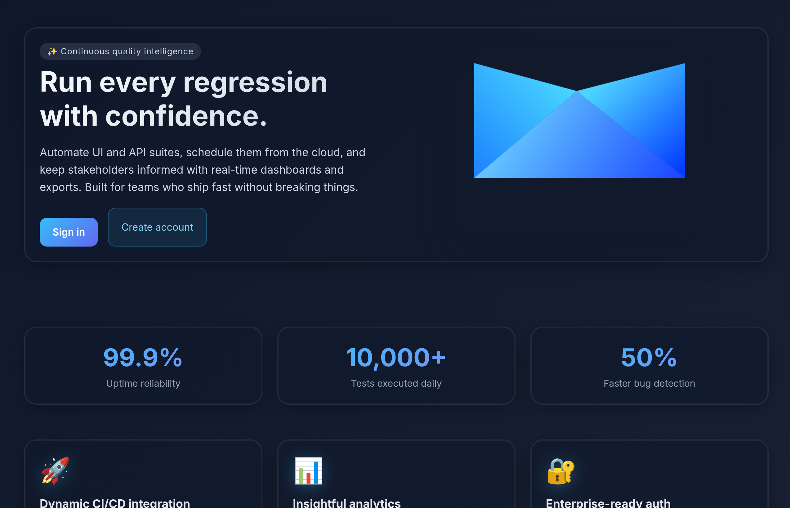

# Infosys Springboard Internship (Batch 1) – Automated Testing Framework

> **A flagship Infosys Springboard internship project delivering end-to-end quality intelligence for modern software teams.**

<div align="center">



[](https://openjdk.org/)
[](https://spring.io/projects/spring-boot)
[](https://www.mysql.com/)
[](LICENSE)

[🌐 Live Demo](https://test-automation-framework-latest.onrender.com) • [🎥 Interactive Sandbox](https://test-automation-framework-latest.onrender.com/demo/login) • [📖 Documentation](#table-of-contents)

</div>

---

## 🎯 Overview

Automate UI and API suites, orchestrate schedules, and surface actionable analytics from a single Spring Boot portal. Designed and implemented by Batch 1 interns as a production-ready reference implementation that blends engineering rigor with polished product experience.

### Key Highlights

- ⚡ **Accelerate regression cycles** by centralizing test authoring, scheduling, execution, and reporting
- 👥 **Target users:** QA engineers, SDETs, release managers, and delivery leads
- 🛠️ **Tech stack:** Java 25, Spring Boot 3.4, Thymeleaf, Selenium WebDriver, MySQL 8.x, Quartz, Spring Async, Docker

---

## 📑 Table of Contents

- [Project Narrative](#-project-narrative)
- [Product Capabilities](#-product-capabilities)
- [Architecture Overview](#-architecture-overview)
- [Experience the Platform](#-experience-the-platform)
- [Getting Started for Developers](#-getting-started-for-developers)
- [Test Authoring Handbook](#-test-authoring-handbook)
- [Continuous Delivery Automation](#-continuous-delivery-automation)
- [Public Endpoints & Navigation](#-public-endpoints--navigation-map)
- [Operations & Deployment](#-operations--deployment)
- [Roadmap & Reflections](#-roadmap--internship-reflections)
- [Contributors](#-contributors)

---

## 📖 Project Narrative

Infosys Springboard's inaugural internship batch was challenged to create a platform that could:

- ✅ **Unify fragmented automation efforts** across API and UI suites
- 📊 **Offer management-level visibility** with dashboards that highlight reliability, trendline regressions, and execution SLAs
- 🚀 **Scale with enterprise constraints**, including nightly schedules, multi-project ownership, and rigorous access control

The result is a modular framework that turns JSON definitions into executable suites, streams results to analytics, and closes the loop with notifications and exports.

---

## 🎨 Product Capabilities

<table>
  <thead>
    <tr>
      <th>🔧 Module</th>
      <th>✨ Highlights</th>
      <th>💎 Value Delivered</th>
    </tr>
  </thead>
  <tbody>
    <tr>
      <td><strong>Test Authoring</strong></td>
      <td>JSON-based DSL, bulk import, version snapshots</td>
      <td>Rapid test onboarding without IDE dependency</td>
    </tr>
    <tr>
      <td><strong>Execution Engine</strong></td>
      <td>Parallel runners, Selenium WebDriver integration, API clients</td>
      <td>Reduced runtime and consistent environment setup</td>
    </tr>
    <tr>
      <td><strong>Scheduler</strong></td>
      <td>Cron-like planner, manual triggers, run history</td>
      <td>Predictable daily/weekly/monthly cadences</td>
    </tr>
    <tr>
      <td><strong>Reporting & Analytics</strong></td>
      <td>Trend charts, failure clustering, export to CSV/PDF</td>
      <td>Insightful retrospectives for QA and leadership</td>
    </tr>
    <tr>
      <td><strong>Notifications</strong></td>
      <td>Brevo email integration, custom webhooks</td>
      <td>Immediate stakeholder updates on regressions</td>
    </tr>
    <tr>
      <td><strong>Asset Management</strong></td>
      <td>ImageKit-backed screenshot storage, local fallback</td>
      <td>Rich evidence for debugging UI failures</td>
    </tr>
  </tbody>
</table>

### 🔄 Signature Functional Flows

1. **Regression Planning:** Upload suites → configure cadence → receive deep-dive analytics each morning
2. **Release Readiness:** Execute gating suite on demand → instantly export annotated report for sign-off
3. **Incident Triage:** Use dashboard filters → inspect failure artifacts → re-run impacted suites directly from UI

---

## 🏗️ Architecture Overview

```text
┌──────────────────────┐        ┌──────────────────────┐
│  Web UI (Thymeleaf)  │◀──────▶│  REST Controllers    │
└─────────▲────────────┘        └─────────▲────────────┘
          │                              │
          │                      ┌───────┴─────────┐
          │                      │  Service Layer  │
          │                      │  (Spring Boot)  │
          │                      └───────▲─────────┘
          │                              │
          │                      ┌───────┴─────────┐
          │                      │  Scheduler &    │
          │                      │  Async Workers  │
          │                      └───────▲─────────┘
          │                              │
          ▼                      ┌───────┴─────────┐
┌──────────────────────┐         │ Selenium Runner │
│  MySQL 8 Persistence │         │ + API Client    │
└──────────────────────┘         └───────▲─────────┘
                                          │
                                  ┌───────┴─────────┐
                                  │  Reporting &    │
                                  │  Export Engine  │
                                  └─────────────────┘
```

### 🔐 Core Principles

- **Security:** Spring Security-driven authentication, encrypted secrets for third-party APIs
- **Scalability:** Quartz job store, asynchronous execution pools, Docker packaging for containerized deployments
- **Extensibility:** Modular service abstractions allow plugging in new notification channels or storage providers

---

## 🌟 Experience the Platform

<div align="center">

### 🚀 Try It Now

[](https://test-automation-framework-latest.onrender.com)
[](https://test-automation-framework-latest.onrender.com/demo/login)

</div>

> 📌 **UI Design Cues:** Inspired by enterprise observability dashboards—high-contrast dark mode, strong typographic hierarchy, and call-to-action emphasis for quick navigation between operations, analytics, and scheduling.

---

## 🚀 Getting Started for Developers

### Prerequisites

- ☕ JDK 23+
- 📦 Maven 3.9+
- 🗄️ MySQL 8.x or compatible service
- 🐳 Optional: Docker (for container build)

### Quick Start

```bash
# 1. Copy configuration template
cp src/main/resources/application.properties.example src/main/resources/application.properties

# 2. Configure your environment
# Edit application.properties with database credentials, Brevo keys, and ImageKit configuration

# 3. Run the application
mvn spring-boot:run
```

Visit `http://localhost:8080` and bootstrap your account. A starter project with sample suites is provisioned automatically.

#### 💡 Chromium Compatibility Tip

If Chrome/Chromium introduces a DevTools mismatch, align Selenium's DevTools artifact:

```bash
mvn -Dselenium.devtools.artifact=selenium-devtools-v140 spring-boot:run
```

Replace `selenium-devtools-v140` with the artifact that matches your browser build.

---

## 📝 Test Authoring Handbook

### API Example

```json
{
  "requests": [
    {
      "name": "Health check",
      "method": "GET",
      "url": "https://api.example.com/health",
      "expectedStatus": 200,
      "expectContains": ["ok"]
    }
  ]
}
```

### UI Example

```json
{
  "steps": [
    {"action": "navigate", "url": "http://localhost:8080/demo/login"},
    {"action": "type", "by": "css", "selector": "#email", "text": "user@example.com"},
    {"action": "type", "by": "css", "selector": "#password", "text": "SuperSecret123"},
    {"action": "click", "by": "css", "selector": "button[type=submit]"},
    {"action": "assertTitle", "value": "Automation Demo Login"}
  ]
}
```

### Bulk Import Format

```json
{
  "tests": [
    {
      "name": "Smoke API",
      "type": "API",
      "definition": {
        "requests": [ { "name": "Ping", "method": "GET", "url": "https://httpbin.org/get" } ]
      }
    },
    {
      "name": "Smoke UI",
      "type": "UI",
      "definition": {
        "steps": [
          { "action": "navigate", "url": "http://localhost:8080/demo/login" },
          { "action": "assertTitle", "value": "Automation Demo Login" }
        ]
      }
    }
  ]
}
```

### 📥 Download Ready-Made Import Bundles

<table>
  <thead>
    <tr>
      <th>📦 Suite</th>
      <th>📋 Description</th>
      <th>⬇️ Download</th>
    </tr>
  </thead>
  <tbody>
    <tr>
      <td><strong>UI Sample Pack</strong></td>
      <td>Complete end-to-end BlazeDemo booking scenarios showcasing waits, assertions, and form fills.</td>
      <td><a href="https://raw.githubusercontent.com/cbeAbishek/Springboard/Abi/UI_test_case.json" download></a></td>
    </tr>
    <tr>
      <td><strong>API Sample Pack</strong></td>
      <td>HTTPBin-powered CRUD collection covering auth headers, redirects, and status assertions.</td>
      <td><a href="https://raw.githubusercontent.com/cbeAbishek/Springboard/Abi/API_test_case.json" download></a></td>
    </tr>
  </tbody>
</table>

---

## 🔄 Continuous Delivery Automation

`.github/workflows/ci-tests.yml` keeps the project healthy by running on every push, daily at 06:00 UTC, and on manual dispatch:

```yaml
name: Java Test Suite

on:
  push:
    branches:
      - '**'
  schedule:
    - cron: '0 6 * * *'
  workflow_dispatch:

jobs:
  test:
    runs-on: ubuntu-latest
    steps:
      - uses: actions/checkout@v4
      - uses: actions/setup-java@v4
        with:
          distribution: temurin
          java-version: '23'
          cache: maven
      - run: mvn -B test
      - name: Publish README summary
        run: |
          {
            echo "## Project README"
            echo ""
            cat README.md
          } >> "$GITHUB_STEP_SUMMARY"
```

Every run publishes the README into the workflow summary, giving stakeholders instant access to the latest documentation alongside build results.

---

## 🗺️ Public Endpoints & Navigation Map

| 🔗 Route | 📡 Method(s) | 📄 Description |
| --- | --- | --- |
| `/` | GET | Landing page with single-click access to sign in or explore the product narrative. |
| `/demo/login` | GET | Lightweight sandbox UI demonstrating the built-in test selectors. |
| `/dashboard` | GET | Authenticated workspace summarizing active projects and quality trends. |
| `/test-management` | GET/POST | Manage, import, and execute JSON-defined suites. |
| `/scheduler` | GET/POST | Configure cron-like jobs and trigger runs on demand. |
| `/reports` | GET/POST | Analyze regression history, export filtered datasets. |
| `/api/run/project/{projectId}` | POST | Fire-and-forget endpoint for CI/CD tools to trigger full project executions (expects optional `X-AUTOMATION-TOKEN` header). |

---

## 🐳 Operations & Deployment

### Docker Workflow

```bash
# Build the Docker image
docker build -t automation-platform .

# Run the container
docker run -p 8080:8080 automation-platform
```

### Testing Locally

```bash
mvn -B test
```

Unit tests currently cover the reporting and export services. Expanding coverage to the scheduling engine and notification adapters is planned.

---

## 🗓️ Roadmap & Internship Reflections

### Near-Term Enhancements

- 🔐 **OAuth2 SSO** for enterprise rollout
- 📊 **Advanced analytics** (flaky test detection, failure clustering)
- 🔗 **Jira/ServiceNow connectors** for automated defect logging

### Lessons from Batch 1

- ✅ Early alignment on data contracts simplified UI/Backend collaboration
- ⚡ Scheduled load tests were key to sizing thread pools and database connections
- 📚 Automating documentation (README summaries in CI) keeps stakeholders informed without manual effort

> 💡 **Interested in extending the framework?** Submit a pull request or open a discussion—Batch 1 will happily guide the next wave of interns!

---

## 👥 Contributors

<div align="center">

Made with ❤️ by **Infosys Springboard Batch 1 Interns**

[⭐ Star this repo](https://github.com/cbeAbishek/Springboard) • [🐛 Report Issues](https://github.com/cbeAbishek/Springboard/issues) • [🤝 Contribute](https://github.com/cbeAbishek/Springboard/pulls)

</div>

---

<div align="center">

**© 2024 Infosys Springboard | Built with passion and precision**

</div>
